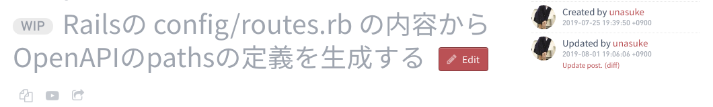

# OpenAPI 3 によるスキーマラスト開発
subtitle
: 2019-08-01

subtitle
: 表参道.rb #49

author
: うなすけ

theme
: unasuke-white


# 自己紹介
- 名前 : うなすけ
- 仕事 : 株式会社バンク (エンジニア)
  - インフラ寄りサーバーサイドエンジニア
  - Ruby, Rails, Kubernetes...

- {::tag name="x-small"}GitHub [@unasuke](https://github.com/unasuke){:/tag}
- {::tag name="x-small"}Mastodon [@unasuke@mstdn.unasuke.com](https://mstdn.unasuke.com/@unasuke){:/tag}
- {::tag name="x-small"}Twitter [@yu\_suke1994](https://twitter.com/yu_suke1994){:/tag}

{:relative_width="24" align="right" relative_margin_right="-10" relative_margin_top="42"}

# OpenAPI 3
{:relative_width="90"}

<https://www.openapis.org/>

- YAMLやJSONで REST APIの仕様を記述するやつ
- Swaggerとか聞いたことある人多いんでは

# OpenAPI 3
- スキーマファースト開発で使われる
  - serverとclientがAPIのschemaを定義してから開発
    - 手戻りが少ない
    - documentができる
- [スキーマファースト開発のススメ - onk.ninja](https://blog.onk.ninja/2017/09/21/schema_first_development)

# OpenAPI 3 例
```yaml
openapi: 3.0.0
info:
  title: Sample API
  description: Optional multiline or single-line description
  version: 0.1.9
servers:
  - url: http://api.example.com/v1
    description: Optional server description, e.g. Main (production) server
  - url: http://staging-api.example.com
    description: Optional server description, e.g. Internal staging server for testing
paths:
  /users:
    get:
      summary: Returns a list of users.
      description: Optional extended description in CommonMark or HTML.
      responses:
        '200':    # status code
          description: A JSON array of user names
```

<https://swagger.io/docs/specification/basic-structure/>

# 現実世界には様々なことがある
- 途中からOpenAPIを導入したい
 - 大量の定義を書かねばならぬ
  - タスクがパンク
    - 終了

# `config/routes.rb` があるじゃん
- ここからなんとか paths のやつだけ自動生成できないか？

# できた
<https://github.com/unasuke/openapi3_definition_generator-rails>

# つらみ
ここからコードを見ながら話します

# つらみ
- 何もかもがPrivate API

# まとめ
- 今月中にブログ書きます

{:relative_width='100'}
